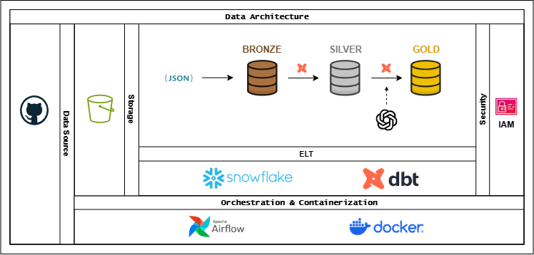
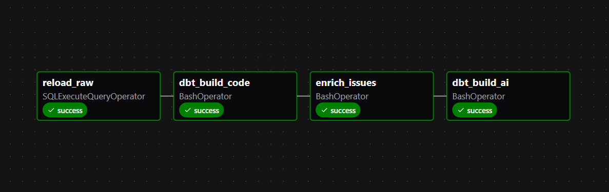

# GitHub Insights Pipeline: Data Stack ELT with LLM Enrichment


An end-to-end analytics pipeline that extracts activity data (issues, comments, labels, milestones) from a GitHub repository via the GitHub REST API, lands it in S3, loads it into Snowflake, transforms it into a dimensional model with dbt, and enriches issues with LLM-based severity classification. The batch is orchestrated with Apache Airflow and runs in Docker.

The pipeline currently runs against [`pallets/flask`](https://github.com/pallets/flask) as a working example, but the ingestion layer is parameterized so it can point at any public GitHub repository.

## Overview

```
GitHub API → S3 (raw JSON) → Snowflake (Bronze) → dbt (Silver → Gold) → LLM enrichment → Gold
```

- **Source**: GitHub REST API (issues, comments, labels, milestones)
- **Storage**: raw JSON landed in S3, used as the staging layer for Snowflake
- **Warehouse**: Snowflake, with a Bronze / Silver / Gold layering (medallion architecture)
- **Transformation**: dbt, with incremental models, schema tests, and referential integrity tests
- **AI enrichment**: an OpenAI model classifies issue severity and writes the result back into the warehouse
- **Orchestration**: Apache Airflow 3.x (LocalExecutor), containerized with Docker Compose

## Architecture

- **Data source**: GitHub REST API.
- **Storage**: S3 holds the raw JSON extracted from the API, partitioned by entity (`raw/issues/`, `raw/comments/`, `raw/labels/`, `raw/milestones/`).
- **ELT**: Snowflake is the warehouse; dbt owns every transformation from Bronze to Silver and from Silver to Gold (the dbt logo marks both transformation steps in the diagram).
- **AI enrichment**: reads issue data from the Gold layer (`fact_issues`), sends it to an OpenAI model, and writes the classification back into the warehouse. The result is then exposed as an additional Gold model, so in practice this is a loop on top of Gold rather than a separate terminal layer — the diagram simplifies this as a step between Silver and Gold.
- **Orchestration & containerization**: Airflow schedules the batch; Docker Compose runs Airflow's components (API server, scheduler, DAG processor) plus its metadata database.
- **Security**: access from Snowflake to S3 is scoped through a storage integration (AWS IAM role), and pipeline permissions inside Snowflake are scoped to a dedicated `DBT_ROLE`.

The diagram does not include RAG or Text-to-SQL, those are not implemented and are tracked in [Roadmap](#roadmap).

## Data Flow

### 1. Ingestion
[`ingestion/github_api_ingestion.py`](ingestion/github_api_ingestion.py) calls the GitHub REST API for a configurable `GITHUB_OWNER` / `GITHUB_REPO`, paginates through `labels`, `milestones`, `issues` and `issues/comments`, writes each entity as newline-delimited JSON, and uploads it to `s3://<S3_BUCKET>/raw/<entity>/`. It checks the API rate limit before and after the run, and authenticates with `GITHUB_TOKEN` or, if that's not set, falls back to `gh auth token` (GitHub CLI).

This step currently runs standalone — it is **not** wired into the Airflow DAG (see [Implementation Notes](#implementation-notes)).

### 2. Loading into Snowflake (Bronze)
The `snowflake/` scripts set up the warehouse, database, schemas, a storage integration pointing at the S3 bucket, and the Bronze tables (`comments`, `issues`, `labels`, `milestones`), each storing the raw payload as `VARIANT` alongside `source_file` and `ingestion_timestamp`. The Airflow DAG's `reload_raw` task runs the equivalent `COPY INTO` statements as part of the daily batch.

### 3. Transformation (dbt)
**Silver** (views) parses the raw JSON into typed columns:
- `silver_issues`, `silver_comments`, `silver_labels`, `silver_milestones`: direct casting from `raw_json`.
- `silver_issues_labels`: flattens the `labels` array on each issue (`lateral flatten`) into an issue–label pair.
- `silver_users`: unions the user fields embedded in both issues and comments and deduplicates by `user_id`, keeping the most recent record.

**Gold** (tables) builds a star schema:
- `dim_users`, `dim_labels`, `dim_milestones`, `dim_dates` (generated with `dbt_utils.date_spine`), and the bridge table `dim_issues_labels`.
- `fact_issues` and `fact_comments`: incremental models (`merge` strategy, `on_schema_change='append_new_columns'`), each keyed by its natural id and carrying surrogate date keys (`created_date_key`, `updated_date_key`, `closed_date_key`) for joining to `dim_dates`.
- `mart_backlog_daily`: daily issues created/closed, net change, and a running backlog.
- `mart_issue_lifecycle`: per-issue metrics: comment count, distinct commenters, time to first comment, discussion duration, resolution time, and the aggregated label list.

### 4. AI Enrichment
[`ai/enrich_issues.py`](ai/enrich_issues.py) fetches pending issues from `GOLD.fact_issues`, submits issue body and title context to OpenAI `gpt-4o-mini`, and appends structured classification records to `GITPROJ.AI.ISSUES_ENRICH`.

#### Enriched Data Sample (`mart_issues_enriched`)

| issue_id | severity | confidence_score | reasoning | evidence | enriched_at |
| :--- | :--- | :--- | :--- | :--- | :--- |
| `ISS-1024` | `critical` | `0.95` | Unexpected memory leak during high-concurrency request routing causing worker pod crashes. | "Memory usage scales exponentially until SIGKILL on worker node." | `2026-09-18 10:15:00` |
| `ISS-1025` | `medium` | `0.88` | Minor alignment bug in UI table header on mobile viewports. | "Header columns overlap when resolution drops below 768px." | `2026-09-18 10:15:02` |
| `ISS-1026` | `low` | `0.92` | Typo in documentation regarding configuration environment variables. | "Typo in README under database setup section." | `2026-09-18 10:15:05` |

### 5. Data Quality & Testing
dbt schema tests enforce `unique` and `not_null` constraints across natural keys, alongside referential integrity (`relationships`) checks linking facts (`fact_issues`, `fact_comments`) with dimensions.

---

## Orchestration

Airflow 3.x runs with `LocalExecutor` on Docker Compose, split into the components (`api-server`, `scheduler`, `dag-processor`) plus a Postgres metadata database, using the FAB auth manager for classic username/password login. dbt runs inside its own virtual environment in the image, isolated from Airflow's dependencies.

The single DAG, `gitproj_batch` (`@daily`), chains:



- `reload_raw` copies the staged files into Bronze.
- `dbt_build_code` runs every non-AI model
- `enrich_issues` runs the Python classification script.
- `dbt_build_ai` rebuilds `mart_issues_enriched` from the freshly written enrichment table.

## Tech Stack

| Layer | Technology |
|---|---|
| Data source | GitHub REST API |
| Raw storage | AWS S3 |
| Data warehouse | Snowflake |
| Transformation | dbt (`dbt-snowflake` 1.8) + `dbt_utils` |
| Orchestration | Apache Airflow 3.x (LocalExecutor) |
| Containerization | Docker / Docker Compose |
| AI enrichment | OpenAI API (`gpt-4o-mini`) |
| Language | Python (ingestion, AI enrichment), SQL + Jinja (dbt) |

## Repository Structure

```
github-repo-analytics-elt/
├── ingestion/
│   └── github_api_ingestion.py     # GitHub API -> S3
├── snowflake/
│   ├── _storage_integration.sql    # S3 <-> Snowflake IAM integration
│   ├── _setup.sql                  # warehouse, database, schemas, DBT_ROLE
│   ├── _create_bronze_tables.sql
│   ├── _stage_and_formats.sql      # external stage + JSON file format
│   └── _load_bronze.sql            
├── gitproj/                        # dbt project
│   ├── models/
│   │   ├── silver/                 # typed, flattened, deduplicated views
│   │   └── gold/                   # dimensional model + marts
│   ├── macros/
│   │   └── generate_schema_name.sql
│   ├── dbt_project.yml
│   └── packages.yml
├── ai/
│   └── enrich_issues.py            # LLM-based issue severity classification
├── airflow/
│   ├── dags/
│   │   └── gitproj_batch.py
│   ├── Dockerfile
│   └── docker-compose.yaml
└── assets/images/architecture.png
```

## Data Model

The Gold layer is a Kimball-style star schema:

- **Facts**: `fact_issues` (grain: one row per issue), `fact_comments` (grain: one row per comment).
- **Dimensions**: `dim_users`, `dim_labels`, `dim_milestones`, `dim_dates`.
- **Bridge**: `dim_issues_labels` resolves the many-to-many relationship between issues and labels.
- **Marts**: `mart_backlog_daily` (time series), `mart_issue_lifecycle` (per-issue derived metrics), `mart_issues_enriched` (AI classification output).

## Getting Started

> ⚠️ **Cost & Free Trial Note**
> This project is designed to run efficiently on standard cloud Free Trial accounts:
> - **Snowflake & AWS S3**: Fully compatible with 30-day Free Trial / AWS Free Tier allocations.
> - **OpenAI API**: Uses lightweight `gpt-4o-mini` calls (costs a few cents for typical repositories). Alternatively, the LLM script can be adapted to free local providers (e.g., Ollama).

### Prerequisites
- Snowflake account with admin setup privileges.
- AWS S3 bucket and IAM Role configured for Snowflake integration.
- GitHub token (`GITHUB_TOKEN`) or authenticated GitHub CLI (`gh`).
- OpenAI API Key.
- Docker and Docker Compose installed locally.

### 1. Snowflake setup (run once)
Fill in the placeholders (AWS account id, IAM role name, bucket name) and run the scripts under `snowflake/` in order:

```
_setup.sql                 # warehouse, database, schemas, DBT_ROLE
_storage_integration.sql   # creates the STORAGE INTEGRATION, grants it to DBT_ROLE
_stage_and_formats.sql     # external stage over the S3 bucket
_create_bronze_tables.sql
_load_bronze.sql
```

### 2. Environment variables
For the ingestion script (run locally, not inside a container):

```
GITHUB_TOKEN=...           # or have `gh auth login` already done
GITHUB_OWNER=pallets       # optional, defaults to pallets
GITHUB_REPO=flask          # optional, defaults to flask
S3_BUCKET=github-repo-analytics-elt
```
AWS credentials are picked up through boto3's default credential chain (AWS CLI profile, environment variables, or an assumed role).

For Airflow (`airflow/.env`, per the header comment in `docker-compose.yaml`):

```
SNOWFLAKE_ACCOUNT=...
SNOWFLAKE_USER=...
SNOWFLAKE_PASSWORD=...
OPENAI_API_KEY=...
```

`dbt`'s `profiles.yml` is gitignored and expected inside `gitproj/` (the DAG runs dbt with `--profiles-dir` pointing at the project directory). A minimal profile looks like:

```yaml
gitproj:
  target: dev
  outputs:
    dev:
      type: snowflake
      account: "{{ env_var('SNOWFLAKE_ACCOUNT') }}"
      user: "{{ env_var('SNOWFLAKE_USER') }}"
      password: "{{ env_var('SNOWFLAKE_PASSWORD') }}"
      role: DBT_ROLE
      database: GITPROJ
      warehouse: GITPROJ_WH
      schema: SILVER
      threads: 4
```

### 3. Run the ingestion script
```bash
pip install boto3 requests
python ingestion/github_api_ingestion.py
```

### 4. Run the batch
```bash
cd airflow
docker compose build && docker compose up -d
```
Airflow UI at `http://localhost:8080` (`admin` / `admin`). Trigger the `gitproj_batch` DAG from the UI, or:
```bash
docker compose exec apiserver airflow dags trigger gitproj_batch
```

Alternatively, run dbt and the enrichment step directly, without Airflow:
```bash
cd gitproj
dbt deps
dbt build --exclude tag:ai
python ../ai/enrich_issues.py
dbt build --select tag:ai
```

## Roadmap

- Add the ingestion step as a task in the Airflow DAG, so a single run covers API extraction through AI enrichment.
- Retrieval-augmented generation (RAG) over issue and comment text, for natural-language Q&A on repository activity.
- A Text-to-SQL interface over the Gold layer and marts.
- CI (GitHub Actions) running `dbt compile` / `dbt test` on pull requests.


## License

This project is open-source and available under the [MIT License](LICENSE).
